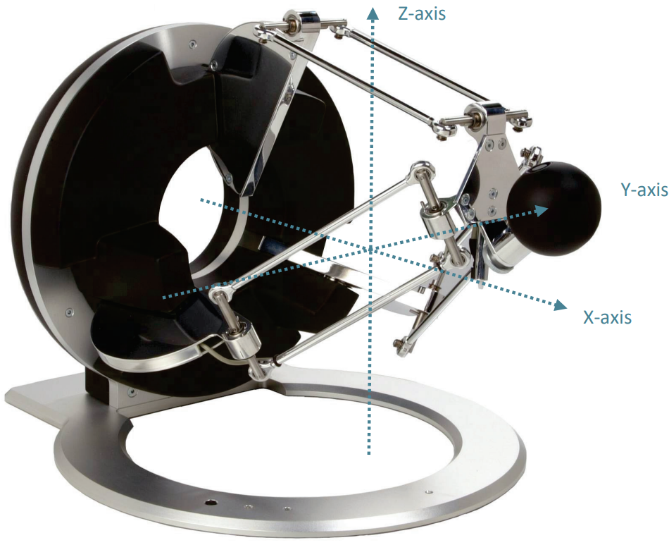

yarp-omega3
======================


Simple YARP-enabled server for the [Force Dimension Omega.3](https://www.forcedimension.com/products/omega) device.

Supports Linux only at the moment.

### Dependencies

- [libpthread](https://www.gnu.org/software/hurd/libpthread.html)
- [libusb](https://libusb.info/)
- [YCM](https://github.com/robotology/ycm)

#### Notes:
- the SDK of the robot is automatically downloaded during the build process
- `libpthread` and `libusb`, both required by the robot SDK, can be easily installed, e.g. in Ubuntu use
   ```
   apt install libusb-1.0-0-dev libpthread-stubs0-dev
   ```

### How to build

```
git clone https://github.com/robotology-playground/yarp-omega3
cd yarp-omega3
mkdir build
cd build
cmake -DCMAKE_INSTALL_PREFIX=<where_to_install> ../
make install
```

In order to use the device in user space, you need to import the provided [udev rule](config/99-omega3-libusb.rules), e.g. in `/etc/udev/rules.d`.

### How to use

Run `yarp-omega3-server` and send RPC commands to `/yarp-omega3-server/rpc:i`.

> please run the `yarpserver` if you did not already before running the `yarp-omega3-server`

Available commands are
- `help`
- `set_force(f_x, f_y, f_z)` (send a force reference)
- `set_position(x, y, z)` (send a static position)
- `track_position(x, y, z)` (send a position, to be used in _streaming_ mode)
- `get_pos_move_parameters()` (returns current amax, vmax, jerk in position control)
- `set_pos_move_parameters(amax, vmax, jerk)` (set motion parameters for position control) 
- `get_tracking_move_parameters()` (returns current amax, vmax, jerk in tracking control)
- `set_tracking_move_parameters(amax, vmax, jerk)` (set motion parameters)
- `stop` (completely disengange robot control)
- `quit` (close the module)


The state of the robot is available in forms of a `yarp::sig::Vector` sent over the port `/yarp-omega3-server/robot_state:o`. It comprises 9 values (3D Cartesian position, 3D linear velocity and 3D exchanged force).

The aforementioned motion parameters are:
- `amax`, the maximum linear acceleration;
- `vmax`, the maximum linear velocity;
- `jerk`, the maximum jerk.

[Sample modules](src/samples/python) written in Python are available.

### Omega coordinate system and control range


Given the mechanical design, the following mentioned values are the maximum reachable per axis. The workspace is limited to a sphere around the center, the further the robot is positioned of center along the x-axis, the less you can move along the y- and z-axis (until you eventually can not move at all when reaching the max x value). The same is true for the other axis.

axis | min [m] | max [m]
-----|-----|-----
x | -0.045 | 0.07
y | -0.09 | 0.09
z | -0.065 | 0.1

#### Note:
- when connected to a usb hub it might be neccesary to reboot system to connect to the robot for the first use.
- the module switches from position to force control depending on the input from the user. After calling `tracking_parameters` or `position_parameters` please call position or force control again. The server will not return in that state on its own.

### Further readings
Further readings about the SDKs you can find when the download is finished in the SDK folder under documentation. We use the Robotic SDK to control the robot and we use the Haptic SDK to read the robot states.

### Implenetation of further functions
The SDKs offer many further functionalities. To implement them add the function to the [Server.h](/src/server/include/Server.h), [Server.cpp](/src/server/src/Server.cpp) and [server_idl.thrift](/src/server/thrift/server_idl.thrift). In the [server_idl.thrift](/src/server/thrift/server_idl.thrift) function names must be distinct. set_position and set_position_params will not work. Instead use set_position and set_pos_params for instance.

### Maintainers
This repository is maintained by:

| | |
|:---:|:---:|
| [](https://github.com/xenvre) | [@xenvre](https://github.com/xenvre) |
